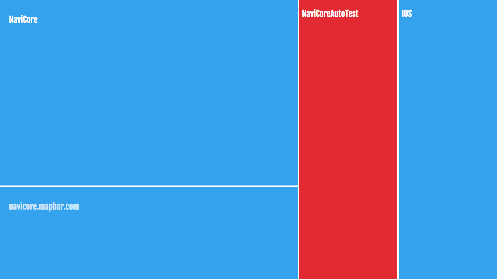

# NaviCore Dashboard

A web page to show Jenkins job status and Google Test results.

> __It's a Work-in-Progress. Please use it at your own risk.__

We put it on a screen near the entrance of our work area.
So if something goes wrong, anyone passes by will notice it.
We have been relying on it for some years. And we plan to improve it in the later half of 2019.



## Features

* Show Jenkins Job status(blue, yellow, red).
* Show the name of failed tests.
* Adaptive layout for both small and large screens.

## Installation and configuration

1. __First need to install node__

2. Switch to the root of the project

3. Modify configuration file (`/data/projects.json`).

   ``` javascript
    [
        {
            "url": "http://build.navicore.cn/job/NaviCore/", //project url
            "name": "NaviCore", //display project name
            "user": "mapbar", 
            "token": "******",
            "importance": 4, //Determined the size of the screen
            "googleTestResultUrl": "" //It is not an option that must be filled out
        },
        {
            "url": "http://build.navicore.cn/job/NaviCoreTest/", //project url
            "name": "NaviCoreTest", //display project name
            "user": "mapbar", 
            "token": "******",
            "importance": 4, //Determined the size of the screen
            "googleTestResultUrl": "" //It is not an option that must be filled out
        }
    ]
   ```

4.  Installation dependency & Running project.
    ``` bash
    npm install
    npm start
    ```


## Planing Features

* Read data from XML output of GoogleTest.
* Hierarchical display. (Click to show more details. Jobs -> Test Suites -> Test Cases)
* Timeline. Show the status history so that you can see when the job failed and when it recovered.

